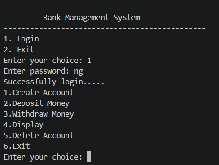
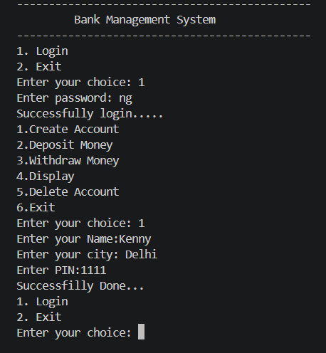
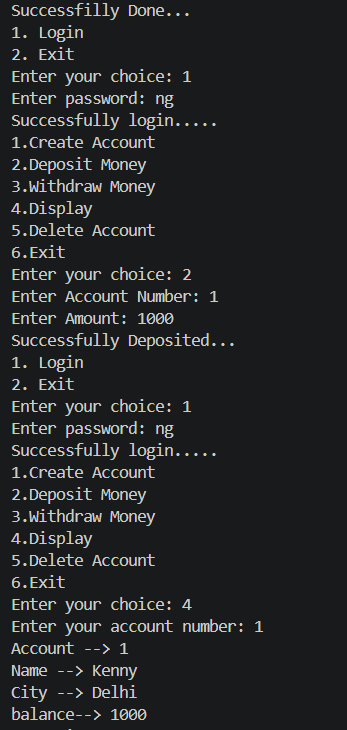
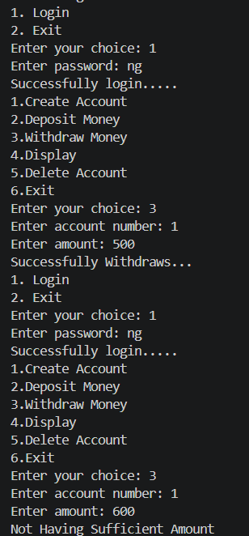
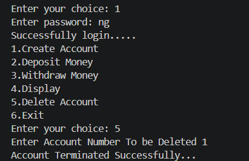

# 🏦 Bank Management System

A console-based Bank Management System built using **Python** and **MySQL**, 
demonstrating Python-SQL connectivity for real-world database operations.

---

## 📌 Features

- 🔐 **Admin Authentication** — Secure login with username & password before accessing any feature
- 👤 **Create Account** — Register new bank accounts with auto-generated account numbers
- 💰 **Deposit Money** — Add funds to any existing account
- 💸 **Withdraw Money** — Withdraw funds with automatic insufficient-balance check
- 📋 **Display Account** — View complete account details by account number
- ❌ **Delete Account** — Permanently close and remove a bank account

---

## 🛠️ Tech Stack

| Technology | Purpose |
|---|---|
| Python | Core application logic |
| MySQL | Database for storing account & login data |
| mysql-connector-python | Python-MySQL connectivity |

---

## 🗄️ Database Schema

**Table: `login`** — Stores admin credentials  
**Table: `bank_master`** — Stores customer account details (acc_no, name, city, PIN, balance)  
**Table: `sno`** — Tracks auto-increment account number sequence

---

## ▶️ How to Run Locally

### Prerequisites
- Python 3.x installed
- MySQL installed and running
- Install the connector:
```bash
pip install mysql-connector-python
```

### Steps
1. Clone this repository:
```bash
git clone https://github.com/KennyGhosh/bank-management-system.git
```
2. Open `final_cs_project.py` and update your MySQL credentials:
```python
mydb = mysql.connector.connect(
    host="localhost",
    user="your_mysql_username",
    password="your_mysql_password"
)
```
3. Run the program:
```bash
python final_cs_project.py
```
The database and tables are created automatically on first run.

---

## 📸 Output Screenshots

### Login & Main Menu


### Create Account


### Deposit & Display


### Withdraw & Display


### Delete Account


---

## 👨‍💻 Author
**Kenny Ghosh**  
BCA | [LinkedIn](https://www.linkedin.com/in/kenny-ghosh-873753330/) | [GitHub](https://github.com/KennyGhosh)